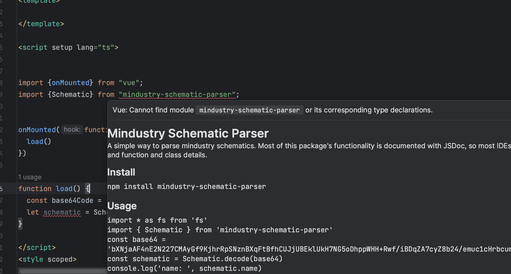

## Vue: Cannot find module mindustry-schematic-parser or its corresponding type declarations reproduction
## And vite build error reproduction
```
vite build
vite v4.5.0 building for production...
[plugin:vite:resolve] Module "url" has been externalized for browser compatibility, imported by "/Users/wangjingyue/WebstormProjects/demo0/node_modules/mindustry-schematic-parser/dist/index.mjs". See http://vitejs.dev/guide/troubleshooting.html#module-externalized-for-browser-compatibility for more details.
[plugin:vite:resolve] Module "node:path" has been externalized for browser compatibility, imported by "/Users/wangjingyue/WebstormProjects/demo0/node_modules/pkg-dir/index.js". See http://vitejs.dev/guide/troubleshooting.html#module-externalized-for-browser-compatibility for more details.
[plugin:vite:resolve] Module "node:path" has been externalized for browser compatibility, imported by "/Users/wangjingyue/WebstormProjects/demo0/node_modules/find-up/index.js". See http://vitejs.dev/guide/troubleshooting.html#module-externalized-for-browser-compatibility for more details.
[plugin:vite:resolve] Module "node:url" has been externalized for browser compatibility, imported by "/Users/wangjingyue/WebstormProjects/demo0/node_modules/find-up/index.js". See http://vitejs.dev/guide/troubleshooting.html#module-externalized-for-browser-compatibility for more details.
[plugin:vite:resolve] Module "node:fs" has been externalized for browser compatibility, imported by "/Users/wangjingyue/WebstormProjects/demo0/node_modules/path-exists/index.js". See http://vitejs.dev/guide/troubleshooting.html#module-externalized-for-browser-compatibility for more details.
[plugin:vite:resolve] Module "node:process" has been externalized for browser compatibility, imported by "/Users/wangjingyue/WebstormProjects/demo0/node_modules/locate-path/index.js". See http://vitejs.dev/guide/troubleshooting.html#module-externalized-for-browser-compatibility for more details.
[plugin:vite:resolve] Module "node:path" has been externalized for browser compatibility, imported by "/Users/wangjingyue/WebstormProjects/demo0/node_modules/locate-path/index.js". See http://vitejs.dev/guide/troubleshooting.html#module-externalized-for-browser-compatibility for more details.
[plugin:vite:resolve] Module "node:fs" has been externalized for browser compatibility, imported by "/Users/wangjingyue/WebstormProjects/demo0/node_modules/locate-path/index.js". See http://vitejs.dev/guide/troubleshooting.html#module-externalized-for-browser-compatibility for more details.
[plugin:vite:resolve] Module "node:url" has been externalized for browser compatibility, imported by "/Users/wangjingyue/WebstormProjects/demo0/node_modules/locate-path/index.js". See http://vitejs.dev/guide/troubleshooting.html#module-externalized-for-browser-compatibility for more details.
✓ 26 modules transformed.
✓ built in 302ms
"fileURLToPath" is not exported by "__vite-browser-external", imported by "node_modules/locate-path/index.js".
file: /Users/wangjingyue/WebstormProjects/demo0/node_modules/locate-path/index.js:4:8
2: import path from 'node:path';
3: import fs, {promises as fsPromises} from 'node:fs';
4: import {fileURLToPath} from 'node:url';
           ^
5: import pLocate from 'p-locate';
error during build:
RollupError: "fileURLToPath" is not exported by "__vite-browser-external", imported by "node_modules/locate-path/index.js".
    at error (file:///Users/wangjingyue/WebstormProjects/demo0/node_modules/rollup/dist/es/shared/node-entry.js:2287:30)
    at Module.error (file:///Users/wangjingyue/WebstormProjects/demo0/node_modules/rollup/dist/es/shared/node-entry.js:13745:16)
    at Module.traceVariable (file:///Users/wangjingyue/WebstormProjects/demo0/node_modules/rollup/dist/es/shared/node-entry.js:14175:29)
    at ModuleScope.findVariable (file:///Users/wangjingyue/WebstormProjects/demo0/node_modules/rollup/dist/es/shared/node-entry.js:12615:39)
    at ReturnValueScope.findVariable (file:///Users/wangjingyue/WebstormProjects/demo0/node_modules/rollup/dist/es/shared/node-entry.js:7124:38)
    at Identifier.bind (file:///Users/wangjingyue/WebstormProjects/demo0/node_modules/rollup/dist/es/shared/node-entry.js:8319:40)
    at CallExpression.bind (file:///Users/wangjingyue/WebstormProjects/demo0/node_modules/rollup/dist/es/shared/node-entry.js:5892:23)
    at CallExpression.bind (file:///Users/wangjingyue/WebstormProjects/demo0/node_modules/rollup/dist/es/shared/node-entry.js:9890:15)
    at ConditionalExpression.bind (file:///Users/wangjingyue/WebstormProjects/demo0/node_modules/rollup/dist/es/shared/node-entry.js:5892:23)
    at ArrowFunctionExpression.bind (file:///Users/wangjingyue/WebstormProjects/demo0/node_modules/rollup/dist/es/shared/node-entry.js:5892:23)

```
please see /src/App.vue

### module import error


### vite build error


### other project have same module import error problem
